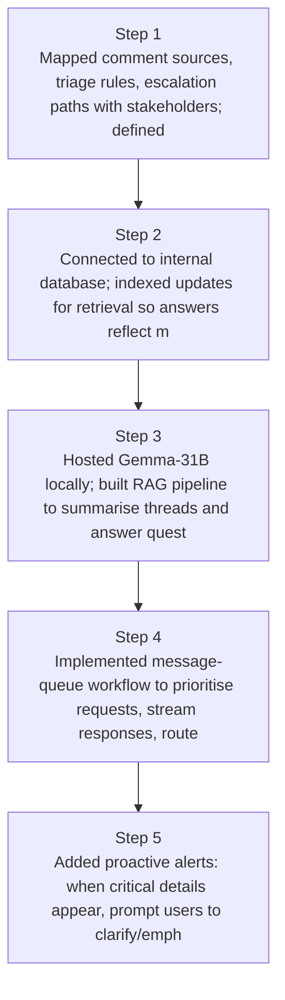
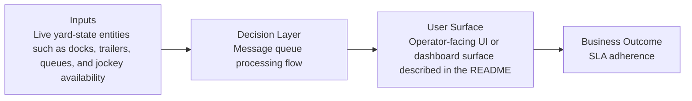
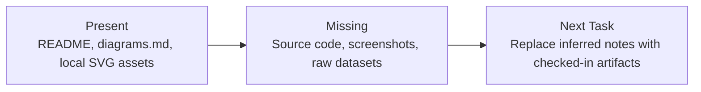

# On-Prem Comment Intelligence Engine Diagrams

Generated on 2026-04-26T04:29:37Z from README narrative plus project blueprint requirements.

## On-prem RAG architecture

## Message queue processing flow

## Evidence Gap Map

